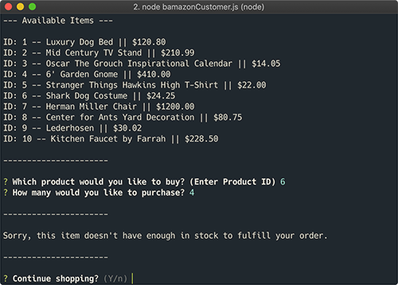
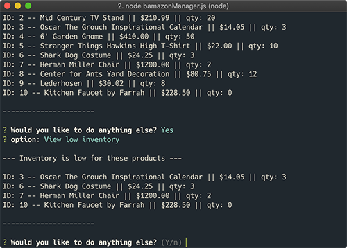
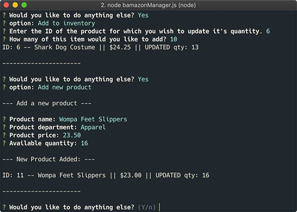
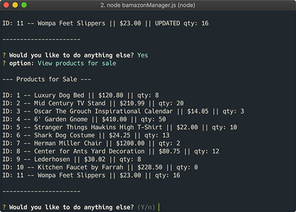
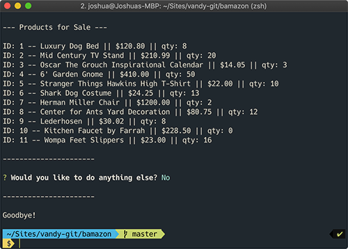

# Bamazon
An Amazon-like CLI project for class. View and "purchase" products as a customer, or view update inventory as a manger.

## Technologies
- MySQL
- Node
  - mysql
  - inquirer
  - dotenv

## Installation
1. Clone or download the repository. Run `npm install` to get load the required dependencies.
2. Run the SQL commands included in the store-setup.sql file to generate a MySQL database.
3. Create a .env file in the root of the directory, and add `DB_PASSWORD=[your MySQL password]`.
4. In your CLI, run `node bamazonCustomer` to view the customer interface.
5. Or, run `node bamazonManager` to view the manager interface.

## Screenshots
### Customer
Customer start

<!-- .element height="50%" width="50%" -->
Customer purchase success

<!-- .element height="50%" width="50%" -->
Customer purchase fail

<!-- .element height="50%" width="50%" -->
Customer exit

<!-- .element height="50%" width="50%" -->

### Manager
Manager start

<!-- .element height="50%" width="50%" -->
Manager view products

<!-- .element height="50%" width="50%" -->
Manager view low inventory

<!-- .element height="50%" width="50%" -->
Manger add inventory

<!-- .element height="50%" width="50%" -->
Manager add product

<!-- .element height="50%" width="50%" -->
Manager view products (with updates)

<!-- .element height="50%" width="50%" -->
Manager exit

<!-- .element height="50%" width="50%" -->